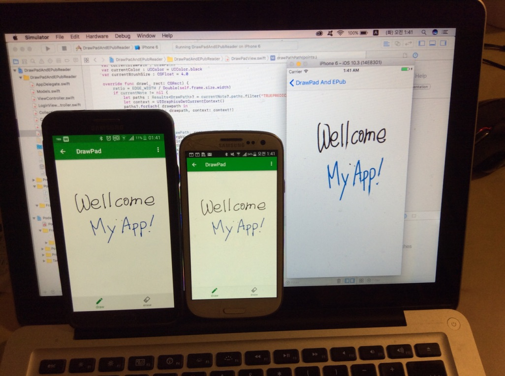
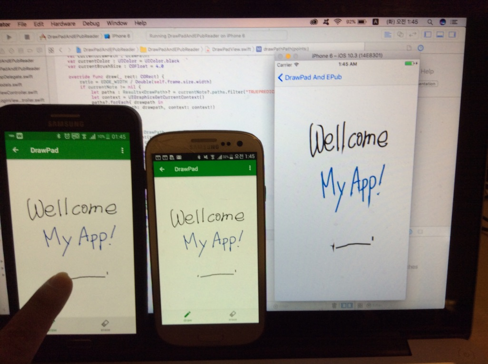

# DrawPadAndEPubReader_swift

This is my personal project for implementing a iOS application with several features like

- Drawing Pad
- EPub Reader (it will be added soon)
- Mobile Database
- Realtime Synchronization

A Realm soultion (https://realm.io) was used for Mobile Database and Realtime Synchronization. 

  
  

## Prerequisites

- Build Realm Object Server (This is a database like SQL server) 
  * Install after downloading the current version 
  * Documentation & Download Url : https://realm.io/docs/get-started/

- Check IP, Port Nuamber of Realm Object Server and make a user in Realm Object Server for this service
  * The port number of Realm Object Server is 9080 
  * If Realm Object Server is localhost, the IP is 127.0.0.1.
  * If Realm Object Server is working at localhost, the admin web site is http://localhost:9080/
  * Create an admin user and then login the admin site with the admin user 
  * Create an other user for your service 
  
  * My configuration is :
  <pre><code>
    static let serverURL: String = "127.0.0.1"
    static let realmID:String = "demo@localhost.io"
    static let realmPasswd:String = "demo1234"
    
    static let syncServerURL = URL(string: "realm://\(serverURL):9080/~/DrawPad")!
    static let syncAuthURL = URL(string: "http://\(serverURL):9080")!
  </code></pre>

## References

